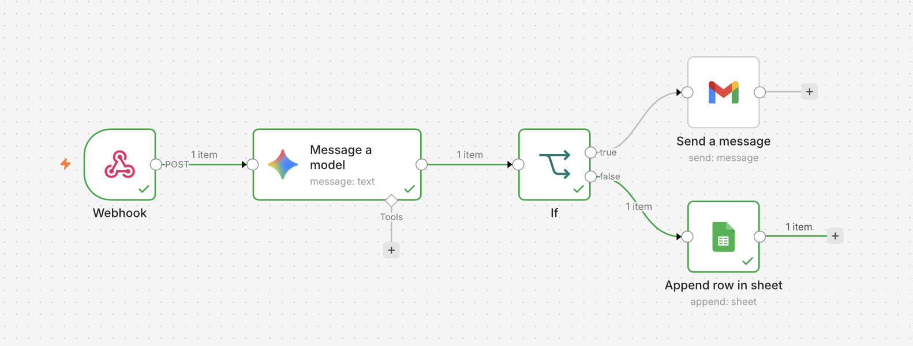

# Asynchronous Automated Customer Feedback Analyzer

A production-ready backend automation pipeline built using **n8n** that handles real-time webhooks, runs conditional logic routing, interacts with generative AI models for classification, and orchestrates cross-platform data synchronization.

---

## 📊 Workflow Architecture

The architecture represents an event-driven, serverless pipeline that completely automates data logging and critical escalation paths for customer support operations.

### 🔄 Data Pipeline Pipeline Flow
1. **Event Trigger:** A live webhook ingestion node captures data payloads instantly upon form submission (via Tally).
2. **AI Processing / Evaluation:** The raw feedback string is evaluated through a language model node to determine customer sentiment and urgency.
3. **Conditional Logic Routing:** An `IF` conditional branch acts as a semantic router:
   * **True Branch (Escalation Path):** Routes highly critical, negative, or urgent feedback directly into internal notification streams (Gmail/Email Alerts) for immediate mitigation.
   * **False Branch (Standard Logging Path):** Routes standard or positive feedback straight to a secure central data warehouse (Google Sheets API) for continuous logging and analytics.

---

## ⚙️ Tech Stack & Integrations

* **Orchestration Engine:** n8n 
* **Data Ingestion:** HTTP Webhooks & REST API Protocols
* **Storage & Operations:** Google Workspace Developer API (Sheets & Docs integration)
* **Logic Framework:** JavaScript Data Manipulation / JSON Object Mapping

---

## 🚀 How to Replicate and Run This Project

### Prerequisites
* A running instance of **n8n**.
* API Credentials linked for your target platforms (Google Workspace OAuth2).

### Installation & Deployment
1. Clone this repository or download the `workflow.json` file.
2. Open your n8n dashboard and click **New Workflow**.
3. In the top-right menu dropdown, select **Import from File** and select `workflow.json`.
4. Connect your webhooks to your front-end form environment, authorize your Google account credentials, and activate the workflow toggle.
